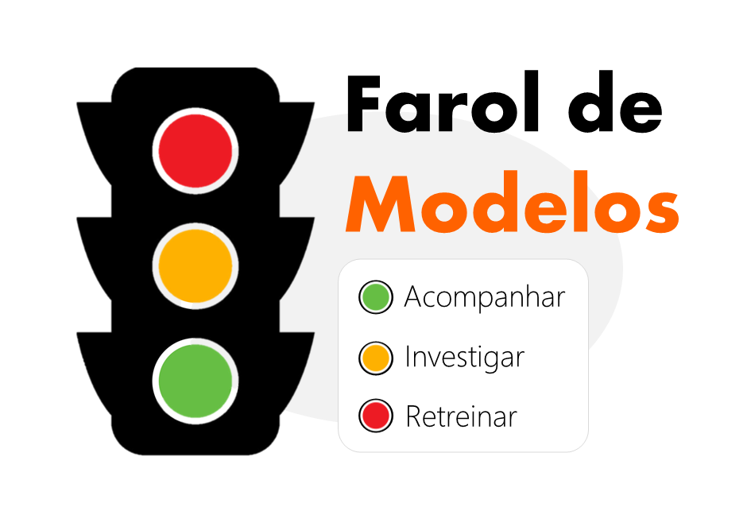

# Farol de Modelos

Neste guia, definiremos limiares para determinar se um modelo é considerado “bom” ou “ruim”. Usando a analogia de um farol, classificaremos os modelos em três categorias: verde (bom), amarelo (aceitável) e vermelho (ruim). Cada uma das categorias exigirá uma ação diferente - <strong> acompanhar </strong> (verde), <strong> investigar </strong> (amarelo) ou <strong> retreinar ou reajuste </strong> (vermelho).

A classificação de um modelo em uma dessas categorias será baseada primeiramente no tipo de problema (classificação, regressão, etc.) e nas métricas de avaliação específicas para esse tipo de problema. Em seguida, definiremos limiares para essas métricas que indicarão se um modelo é considerado bom, aceitável ou ruim. A seguir, apresentamos exemplos de métricas e limiares para diferentes tipos de problemas.

## Tabela de Conteúdos

1. [Classificação Binária](#1.-Classificação-Binária)
    1. [Métricas de Avaliação](#1.1.-Métricas-de-Avaliação)
        1. [Métricas de Poder Discriminatório](#1.1.1.-Métricas-de-Poder-Discriminatório)
            1. [Índice Gini](#1.1.1.1.-Índice-Gini)
            2. [Área Sob a Curva ROC (ROC AUC)](#1.1.1.2.-Área-Sob-a-Curva-ROC-(ROC-AUC))
            3. [Teste Kolmogorov-Smirnov (KS)](#1.1.1.3.-Teste-Kolmogorov-Smirnov-(KS))
            4. [Variações das Métricas de Poder](#1.1.1.4.-Variações-das-Métricas-de-Poder)
        2. [Métricas de Estabilidade](#1.1.2.-Métricas-de-Estabilidade)
            1. [PSI (População Stability Index)](#1.1.2.1.-PSI-(População-Stability-Index))
            2. [Teste Kolmogorov-Smirnov (KS)](#1.1.2.2.-Teste-Kolmogorov-Smirnov-(KS))
            3. [Variações de Público e Target](#1.1.2.3.-Variações-de-Público-e-Target)
    2. [Categoria Final do Farol de Modelos (Classificação Binária)](#1.2.-Categoria-Final-do-Farol-de-Modelos-(Classificação-Binária))
2. [Regressão](#2.-Regressão)
3. [Modelos Causais](#3.-Modelos-Causais)
4. [Referências](#4.-Referências)

## 1. Classificação Binária

### 1.1. Métricas de Avaliação

#### 1.1.1. Métricas de Poder Discriminatório

<strong>Poder discriminatório</strong> refere-se à capacidade de um modelo de distinguir entre as classes positiva e negativa. As métricas de poder discriminatório comuns incluem o índice Gini, a área sob a curva ROC (ROC AUC) e o teste Kolmogorov-Smirnov (KS). <strong>Poder</strong> é um dos eixos de avaliação de um modelo classificação binária, juntamente com a <strong>calibração</strong> e <strong>estabilidade</strong>. Reforçando que para a maioria das aplicações, o poder discriminatório é o mais importante. É possível que um modelo tenha um poder discriminatório muito bom, mas seja mal calibrado. Nesse caso, o modelo ainda pode ser útil, basta realizar uma nova calibrado. Ver [referência](https://www.rogermstein.com/wp-content/uploads/BenchmarkingDefaultPredictionModels_TR030124.pdf).

##### 1.1.1.1. Índice Gini
O [índice Gini](https://www.dss.uniroma1.it/RePec/mtn/articoli/2005-1-1.pdf) pode ser utilizado para mensurar a capacidade de discriminação de um modelo de classificação binária. <strong>A definição do que é considerado um bom valor de Gini pode variar a depender da tarefa específica</strong>, mas a seguir definimos os limiares que empregaremos, considerado [comuns](https://medium.com/anolytics/how-to-evaluate-and-monitor-performance-of-ai-models-for-financial-risk-management-a-practical-b600d50140cb).
<strong>Limiares</strong>:
- Verde: Gini ≥ 40% (boa separação)
- Amarelo: 30% ≤ Gini < 40% (aceitável)
- Vermelho: Gini < 30% (pobre separação)

##### 1.1.1.2. Área Sob a Curva ROC (ROC AUC)
Equivalente ao índice Gini e a este relacionado por uma fórmula ($Gini = 2ROCAUC-1$), o ROC AUC também é comumente empregado para avaliar o desempenho de modelo de classificação binária. Seguem os limiares que empregaremos no farol de modelos.
<strong>Limiares</strong>:
- Verde: AUC ≥ 70% (boa separação)
- Amarelo: 65% ≤ AUC < 70% (aceitável)
- Vermelho: AUC < 65% (pobre separação)

##### 1.1.1.3. Teste Kolmogorov-Smirnov (KS)
O teste KS é comumente usada para medir a <strong>distância</strong> entre duas distribuições de probabilidades. No contexto de modelos de classificação binária, uma das aplicações é mensurando o quão distintas são as distribuições previstas dos registros positivos e negativos. Feitas estas observações, a seguir definimos os limiares que empregaremos, ver a [referência](https://medium.com/anolytics/how-to-evaluate-and-monitor-performance-of-ai-models-for-financial-risk-management-a-practical-b600d50140cb).
<strong>Limiares</strong>:
- Verde: KS nos primeiros 3 decis e maior que 25% (boa separação)
- Amarelo: KS nos primeiros 3 decis e entre 20% e 25% (aceitável)
- Vermelho: KS menor que 20% (pobre separação)

##### 1.1.1.4. Variações das Métricas de Poder
Sendo o poder discriminatório o principal eixo de avaliação de um modelo de classificação binária para a maioria das aplicações, também iremos monitorar as variações das métricas de poder discriminatório do período de validação OOT para o período de inferência atual. A seguir, definimos os limiares que empregaremos.	
<strong>Limiares</strong>:
- Verde: Variação ≤ -5% (pouca mudança)
- Amarelo: -15% ≤ Variação ≤ -5% e Variação ≥ 50% (mudança moderada)
- Vermelho: Variação < - 15% (mudança significativa)

A variação nas métricas de poder, em particular uma queda significativa de poder discriminatório é um dos principais indicativos de que um modelo pode estar sofrendo de <strong>degradação</strong>, e, portanto, é um dos indicadores chave do <strong>farol de modelos</strong>.

#### 1.1.2. Métricas de Estabilidade

<strong>Estabilidade</strong> refere-se à capacidade de um modelo de manter seu desempenho ao longo do tempo. As métricas de estabilidade comuns incluem o PSI (População Stability Index) e o teste Kolmogorov-Smirnov (KS).

##### 1.1.2.1. PSI (População Stability Index)
O PSI mede a mudança na distribuição das probabilidades entre dois conjuntos de dados (por exemplo, validação OOT e inferência atual). Ver [referência](https://medium.com/anolytics/how-to-evaluate-and-monitor-performance-of-ai-models-for-financial-risk-management-a-practical-b600d50140cb). 
<strong>Limiares</strong>:
- Verde: PSI < 10% (pouca mudança)
- Amarelo: 10% ≤ PSI < 25% (mudança moderada)
- Vermelho: PSI ≥ 25% (mudança significativa)

##### 1.1.2.2. Teste Kolmogorov-Smirnov (KS)
O teste KS, também poder ser utilizado para mensurar a estabilidade de modelos. Como mede a <strong>distância</strong> entre duas distribuições de probabilidades, é possível medir a distância entre a distribuição da escoragem de validação OOT e a atual. Ver [referência](https://towardsdatascience.com/understanding-kolmogorov-smirnov-ks-tests-for-data-drift-on-profiled-data-5c8317796f78). Usaremos os seguintes limiares.
<strong>Limiares</strong>:
- Verde: KS ≤ 10% (pouco ou nenhum desvio)
- Amarelo: 10% < Drift ≤ 20% (desvio moderado)
- Vermelho: Drift > 20% (desvio significativo)

##### 1.1.2.3. Variações de Público e Target

A variação de público e target é um dos indicativos de que um modelo pode sofrer <strong>degradação de poder</strong>, se tornando instável. Portanto, é um dos indicadores chave do <strong>farol de modelos</strong> e grandes variações exigem <strong>investigação</strong>, dado que muitas vezes há razões de negócio para as mesmas, sendo que o cientista deveria estar ciente dessas razões nestes casos. A seguir, definimos os limiares que empregaremos.
<strong>Limiares</strong>:
- Verde: -30% ≤ Variação ≤ -30% (pouca mudança)
- Amarelo: Variação < -30% e Variação > 30% (mudança moderada)

### 1.2. Categoria Final do Farol de Modelos (Classificação Binária)

- <strong>Vermelho</strong>: Se um modelo estiver vermelho em pelo menos uma das métricas de <strong>poder discriminatório</strong>, o modelo será considerado vermelho e deverá ser retreinado.
- <strong>Amarelo</strong>: o modelo será considerado amarelo se estiver amarelo em pelo menos uma das métricas de poder discriminatório ou estabilidade.
- <strong>Verde</strong>: Se um modelo estiver verde em todas as métricas de poder discriminatório e estabilidade, o modelo será considerado verde.

Quando o modelo estiver nas categorias amarelo ou vermelho, o cientista de dados deve investigar as causas ou tomar as ações necessárias para corrigir o problema - como por exemplo, um retreino. <strong> O cientista deverá documentar e formalizar as ações tomadas e resultados obtidos por meio de um email ou outro documento</strong>.

## 2. Regressão

Este guia ainda não possui informações sobre modelos de regressão. Os limiares e métricas de avaliação serão definidos em futuras atualizações.

## 3. Modelos Causais

Este guia ainda não possui informações sobre modelos causais. Os limiares e métricas de avaliação serão definidos em futuras atualizações.

## 4. Referências

- [Benchmarking Default Prediction Models](https://www.rogermstein.com/wp-content/uploads/BenchmarkingDefaultPredictionModels_TR030124.pdf)
- [How to Evaluate and Monitor Performance of AI Models for Financial Risk Management: A Practical Guide](https://medium.com/anolytics/how-to-evaluate-and-monitor-performance-of-ai-models-for-financial-risk-management-a-practical-b600d50140cb)
- [Understanding Kolmogorov-Smirnov (KS) Tests for Data Drift on Profiled Data](https://towardsdatascience.com/understanding-kolmogorov-smirnov-ks-tests-for-data-drift-on-profiled-data-5c8317796f78)
- [The Gini Coefficient](https://www.dss.uniroma1.it/RePec/mtn/articoli/2005-1-1.pdf)
- [The Kolmogorov-Smirnov Test for Goodness of Fit](https://www.itl.nist.gov/div898/handbook/eda/section3/eda35g.htm)